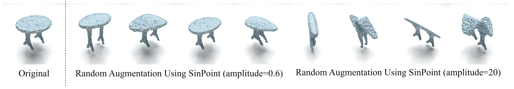

  

Figure 1: Visualization of ablation results for different parameters of SinPoint. Too large deformation will lead to the loss of local geometric information. Therefore, we need proper deformation.

  

Figure 2: Visualization of ablation results for different parameters of SinPoint. Too large deformation will lead to the loss of local geometric information. Therefore, we need proper deformation.
